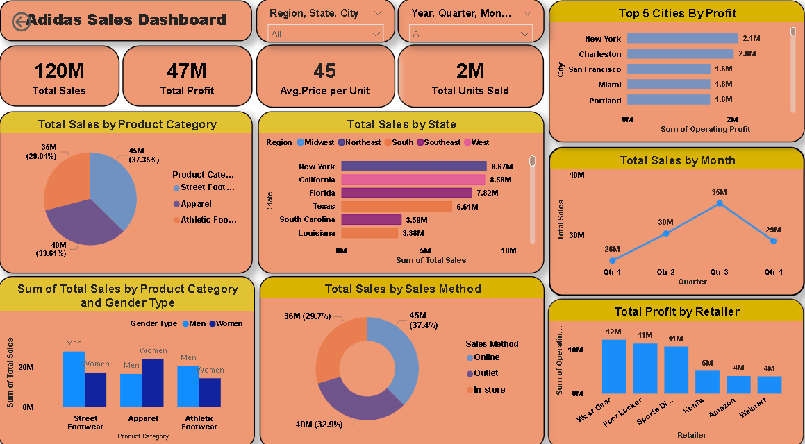

# Adidas-Sales-Analytics-Dashboard
Interactive Power BI dashboard analyzing Adidas retail sales across regions, products and channels

# Adidas Sales Analytics Dashboard
### Tools: Power BI | Business Analytics | Data Visualization

## Dashboard Preview

## Overview
Interactive Power BI dashboard analyzing Adidas retail sales 
performance across regions, products, and channels.

## Key KPIs
| Metric | Value |
|--------|-------|
| Total Sales | 120M |
| Total Profit | 47M |
| Avg Price per Unit | 45 |
| Total Units Sold | 2M |

## Key Insights
- New York & California are top revenue states
- Street Footwear leads product category (37.35%)
- Q3 peak sales of 35M
- Online channel dominates at 37.4%
- West Gear is top retailer with 12M profit
